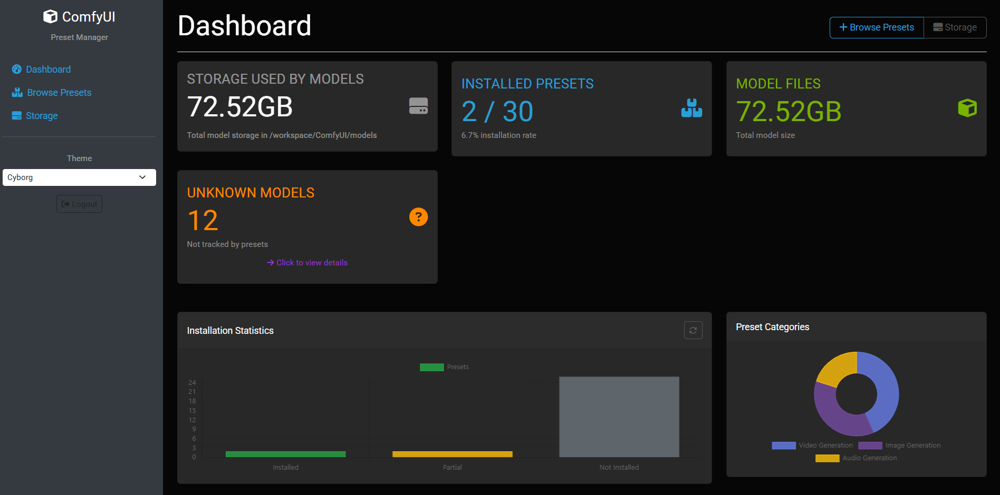
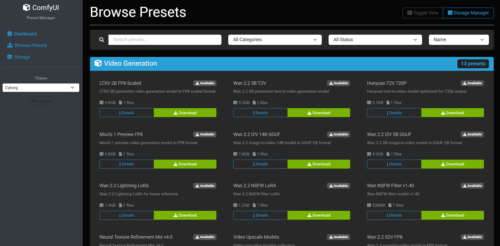
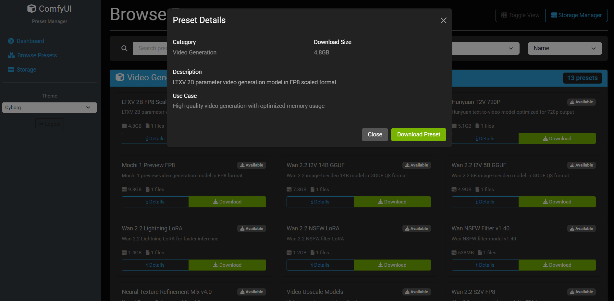

# ComfyUI Preset Manager - Web Interface Guide

> 🌐 **Web-based preset management system for ComfyUI models**
> Access via: `http://your-pod-url:9000`

## Overview

The Preset Manager is a Flask-based web interface that provides an intuitive way to browse, install, and manage ComfyUI model presets. It offers a graphical alternative to command-line preset management, with real-time progress tracking, storage analytics, and integrated documentation viewing.

### Key Features

- **🎛️ Web Dashboard**: Centralized interface for all preset management
- **🔐 Secure Access**: Password protection via `ACCESS_PASSWORD` environment variable
- **📊 Storage Analytics**: Real-time disk usage monitoring and cleanup tools
- **📖 Integrated Documentation**: View detailed preset READMEs inline
- **⬇️ One-Click Installation**: Download and install presets with progress tracking
- **🗂️ Category Browsing**: Organized browsing of Video, Image, and Audio presets
- **📱 Responsive Design**: Works on desktop and mobile devices

---

## 🚀 Getting Started

### Access Requirements

1. **Running Container**: Ensure your ComfyUI container is running
2. **Port Access**: Port 9000 must be exposed (default in all variants)
3. **Authentication**: Set `ACCESS_PASSWORD` environment variable for security

### Accessing the Interface

```
URL: http://your-pod-url:9000
Password: Use ACCESS_PASSWORD environment variable (if set)
```

### Quick Start Tutorial

1. **Open Web Interface**: Navigate to `http://your-pod-url:9000`
2. **Login**: Enter your password (or leave blank if no ACCESS_PASSWORD set)
3. **Browse Presets**: Click on "Presets" to see available models
4. **Select Category**: Choose from Video Generation, Image Generation, or Audio Generation
5. **View Details**: Click any preset to see full documentation and specifications
6. **Install Preset**: Click "Download" to install the preset with progress tracking

---

## 🖥️ Interface Tour

### 1. Main Dashboard



**Features:**
- **Storage Overview**: Total disk space, used space, and available space
- **Installation Statistics**: Total presets, installed count, and installation rate
- **Category Summary**: Quick overview of available preset categories
- **Quick Actions**: Easy access to common management tasks

### 2. Preset Browser



**Features:**
- **Category Tabs**: Switch between Video, Image, and Audio generation presets
- **Search & Filter**: Find presets by name or description
- **Status Indicators**: Visual indicators for installed, partial, and missing presets
- **Installation Info**: Download size, use case, and compatibility details

### 3. Preset Details Page



**Features:**
- **Full README Integration**: View complete preset documentation inline
- **Technical Specifications**: Model details, requirements, and performance info
- **Installation Controls**: Download, delete, and manage individual presets
- **Compatibility Information**: GPU requirements, storage needs, and use cases

### 4. Storage Management


**Features:**
- **Disk Usage Analytics**: Visual breakdown of storage usage by category
- **Model Directory Breakdown**: Detailed file counts and sizes per model type
- **Cleanup Tools**: Remove unused models and reclaim disk space
- **Storage Recommendations**: Tips for optimizing storage usage

### 5. Progress Tracking


**Features:**
- **Real-time Progress**: Live updates during download and installation
- **Operation History**: Track recent downloads and system operations
- **Error Reporting**: Clear error messages and troubleshooting guidance
- **Batch Operations**: Manage multiple simultaneous downloads

---

## 🔧 Configuration

### Environment Variables

| Variable | Description | Default | Required |
|----------|-------------|---------|----------|
| `ENABLE_PRESET_MANAGER` | Enable/disable preset manager (`True`/`False`) | `True` | No |
| `ACCESS_PASSWORD` | Password for web interface authentication | (none) | Recommended |

### Port Configuration

| Port | Service | Access Via | Description |
|------|---------|------------|-------------|
| 9000 | Preset Manager Web | Direct/Nginx | Main web interface |
| 8000 | Preset Manager App | Internal | Flask application (internal) |

### Disabling the Preset Manager

If you don't need the web interface, you can disable it to save resources:

```bash
# Set environment variable
docker run -e ENABLE_PRESET_MANAGER=False zeroclue/comfyui:base-torch2.8.0-cu126
```

---

## 📊 Preset Categories

### 🎬 Video Generation Presets

**Popular Models:**
- **WAN 2.2 Series**: Text-to-video and image-to-video models
- **LTXV 2B**: Real-time video generation
- **Hunyuan T2V**: 720p professional video generation
- **Mochi 1 Preview**: Next-generation video models

**Use Cases:**
- Content creation and social media
- Marketing and promotional videos
- Artistic and experimental video
- Prototyping and concept development

### 🖼️ Image Generation Presets

**Popular Models:**
- **FLUX Series**: State-of-the-art 12B parameter models
- **SDXL Models**: High-resolution image generation
- **Qwen Models**: Superior text rendering capabilities
- **Realistic Vision**: Photorealistic image generation

**Use Cases:**
- Digital art and illustration
- Photography and realistic images
- Marketing materials and graphics
- Concept art and design work

### 🎵 Audio Generation Presets

**Popular Models:**
- **MusicGen**: Text-to-music generation
- **Bark**: High-quality text-to-speech
- **Stable Audio**: Professional audio generation
- **Parler TTS**: Advanced voice synthesis

**Use Cases:**
- Music composition and production
- Voice-over and narration
- Sound design and effects
- Audio content creation

---

## 🔍 Advanced Features

### Storage Analytics

The preset manager provides comprehensive storage monitoring:

**Disk Usage Metrics:**
- Total available space
- Used space by category
- Free space and usage percentage
- Model directory size breakdown

**Storage Optimization:**
- Identify large or unused models
- Cleanup recommendations
- Batch deletion capabilities
- Storage planning tools

### Batch Operations

**Multi-Preset Installation:**
```bash
# Via Web Interface: Select multiple presets and click "Download Selected"
# Via Environment Variable: Set PRESET_DOWNLOAD="preset1,preset2,preset3"
```

**Bulk Management:**
- Multiple preset selection
- Batch deletion operations
- Simultaneous download tracking
- Progress monitoring for all operations

### Integration with Container Scripts

The web interface integrates seamlessly with existing preset download scripts:

- **`download_presets.sh`**: Video generation presets
- **`download_image_presets.sh`**: Image generation presets
- **`download_audio_presets.sh`**: Audio generation presets

All operations initiated through the web interface use the same underlying scripts, ensuring consistency and reliability.

---

## 🛠️ Troubleshooting

### Common Issues

#### 1. Cannot Access Web Interface

**Symptoms**: Connection refused or timeout when accessing port 9000

**Solutions**:
- Verify container is running: `docker ps`
- Check if preset manager is enabled: `docker logs <container_id>`
- Ensure port 9000 is exposed in your deployment configuration
- Verify `ENABLE_PRESET_MANAGER=True` (default)

#### 2. Login Authentication Issues

**Symptoms**: Unable to login with password

**Solutions**:
- Check if `ACCESS_PASSWORD` environment variable is set
- Try with empty password if no ACCESS_PASSWORD is configured
- Verify password spelling and case sensitivity
- Check container logs for authentication errors

#### 3. Download Failures

**Symptoms**: Preset downloads fail or stop midway

**Solutions**:
- Check internet connectivity in container
- Verify sufficient disk space for downloads
- Review `/workspace/logs/preset_manager.log` for error details
- Try downloading smaller presets first

#### 4. Performance Issues

**Symptoms**: Slow interface response or loading times

**Solutions**:
- Check system resource usage (CPU, memory, disk)
- Verify sufficient available RAM
- Check if large downloads are in progress
- Consider using a smaller container variant

### Logs and Debugging

**Preset Manager Logs**:
```
Location: /workspace/logs/preset_manager.log
View with: docker exec <container_id> tail -f /workspace/logs/preset_manager.log
```

**Common Log Entries**:
- `Starting Preset Manager...` - Successful startup
- `Download completed successfully!` - Successful preset installation
- `Download failed:` - Download failure with error details
- `Authentication successful` - Successful login
- `Preset not found` - Invalid preset ID requested

### Recovery and Reset

**Reset Preset Manager**:
```bash
# Restart the preset manager service
docker exec <container_id> pkill -f preset_manager_cli.py

# The service will automatically restart within 30 seconds
```

**Clear Cache and Reset**:
```bash
# Remove operation history and reset status
docker exec <container_id> rm -f /tmp/flask_sessions/*
docker restart <container_id>
```

---

## 📚 Additional Resources

### Related Documentation

- **[Main README](README.md)**: Complete Docker image documentation
- **[Preset List](workspace/docs/preset_list.txt)**: Complete list of all 96 available presets
- **[Individual Preset Documentation](workspace/docs/presets/)**: Detailed information for each preset
- **[Container Startup Scripts](scripts/)**: Underlying preset download mechanisms

### Video Tutorials

*(Placeholder for future video tutorial links)*

### Community Support

- **GitHub Issues**: Report bugs and request features
- **Discussions**: Ask questions and share experiences
- **Wiki**: Community-maintained guides and tutorials

---

## 🔮 Future Enhancements

### Planned Features

- **🔄 Auto-updates**: Automatic preset and model updates
- **📈 Usage Analytics**: Track preset usage patterns and popularity
- **🎨 Themes**: Dark/light mode and customizable interface
- **📱 Mobile App**: Native mobile application for preset management
- **🔌 API Access**: RESTful API for programmatic preset management
- **💾 Backup & Restore**: Save and restore preset configurations
- **🌍 Multi-language**: Interface localization support

### Beta Features

*(Placeholder for experimental features available in testing)*

---

## 📄 License and Support

The Preset Manager is part of the ZeroClue ComfyUI-Docker project and follows the same licensing terms. For support, please use the official GitHub repository.

---

**Last Updated**: December 2024
**Version**: 1.0
**Compatible with**: All ComfyUI-Docker variants