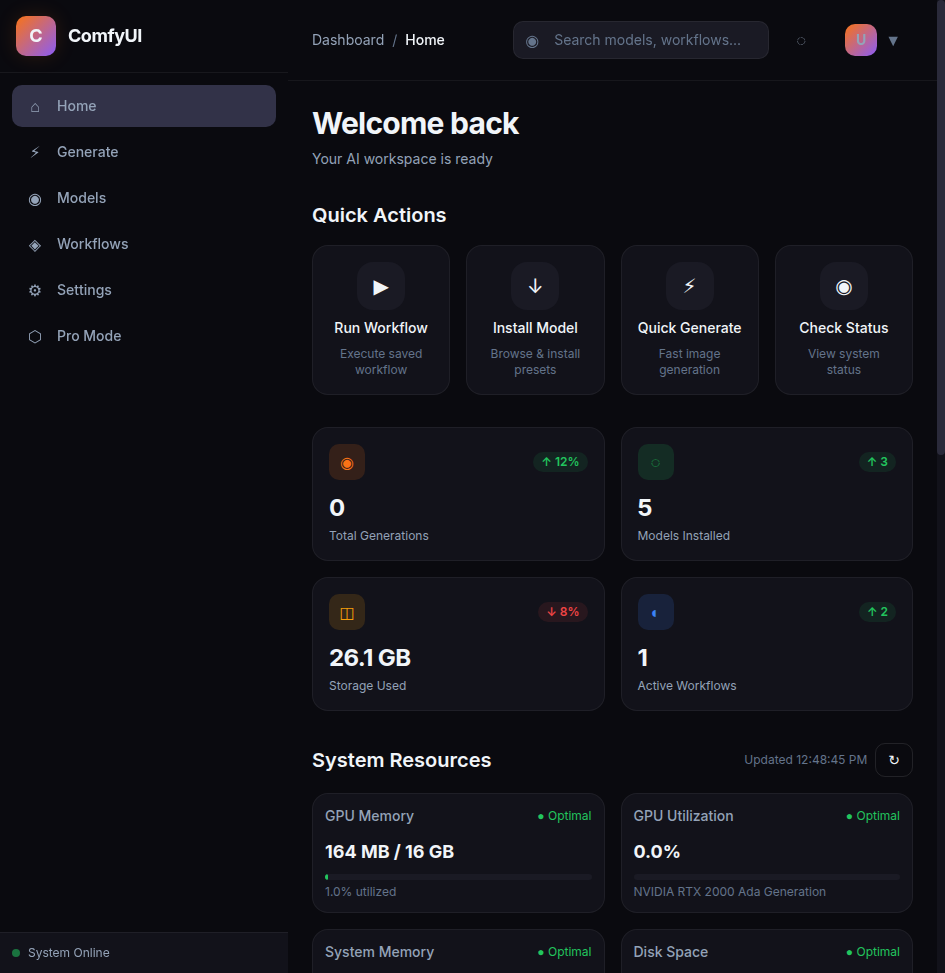
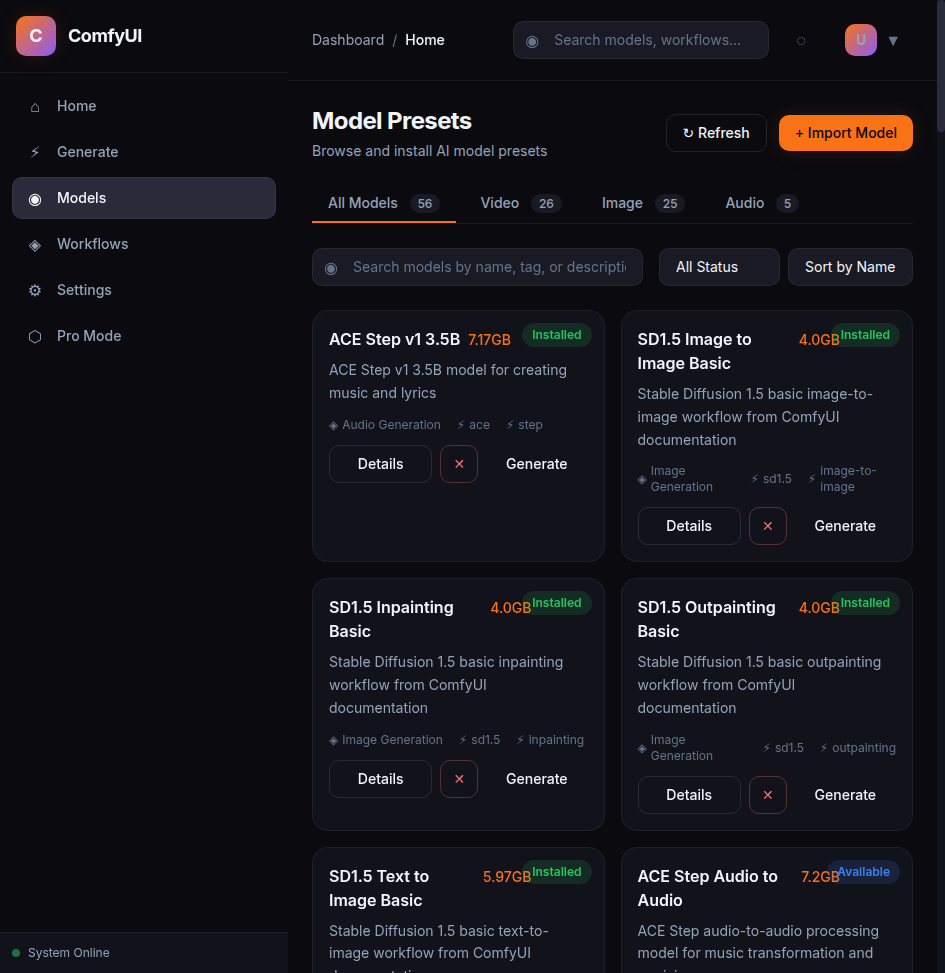
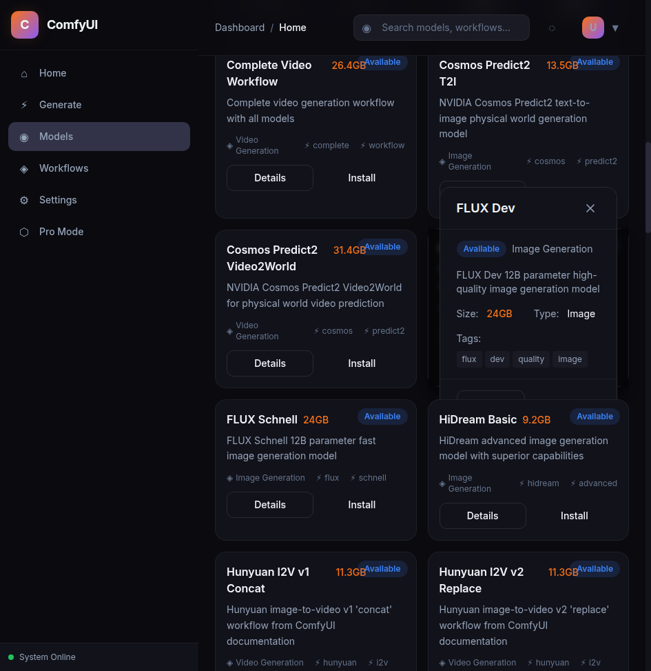
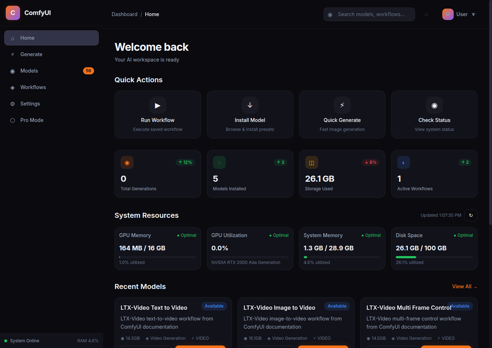

[](https://github.com/ZeroClue/ComfyUI-Docker/actions/workflows/build.yml)

# ZeroClue ComfyUI-Docker

[](https://github.com/ZeroClue/ComfyUI-Docker/actions/workflows/build.yml)
[](https://github.com/ZeroClue/comfyui-presets)
[](https://hub.docker.com/r/zeroclue/comfyui)
[](LICENSE)

> **Features**: 🖥️ Unified Dashboard | 💡 GPU Recommendations | 🔄 Update Tracking | ✅ Checksum Validation | 📊 Real-Time Monitoring

> 💬 Feedback & Issues → [GitHub Issues](https://github.com/ZeroClue/ComfyUI-Docker/issues)

> 🚀 This Docker image is maintained by ZeroClue and designed for both cloud deployment and local use.

> 💰 If you're feeling generous and this has value to you, consider <a href="https://www.buymeacoffee.com/thezeroclue" target="_blank" rel="noopener noreferrer">

</a>

> 🤍 Sign-up at runpod using my referrer link and you can get between $5 and $500 in your account. [Runpod](https://runpod.io?ref=lnnwdl3q)

> 🌟 **Original Project**: This is a customised fork of the excellent [somb1/ComfyUI-Docker](https://github.com/somb1/ComfyUI-Docker) project. All credit goes to the original maintainers for creating this powerful ComfyUI distribution.

## 🔌 Exposed Ports

| Port | Type | Service               | Status |
| ---- | ---- | --------------------- | ------ |
| 22   | TCP  | SSH                   | - |
| 3000 | HTTP | ComfyUI               | Primary |
| 8082 | HTTP | **Unified Dashboard** | Primary |
| 8080 | HTTP | code-server           | Secondary |
| 8888 | HTTP | JupyterLab            | Secondary |
| 9000 | HTTP | Preset Manager        | Legacy (opt-in) |

---

## 🖥️ Unified Dashboard

> **The primary interface for managing ComfyUI models, presets, and system resources.**

### Screenshots

| Home | Models |
|------|--------|
|  |  |

| Preset Detail | System Status |
|---------------|---------------|
|  |  |

### Key Features

- **🎛️ Preset Management**: Browse 56+ presets with GPU compatibility indicators
- **💡 GPU Recommendations**: See which presets fit your GPU's VRAM
- **🔄 Update Tracking**: "Update Available" badges when new versions released
- **✅ Checksum Validation**: SHA256 verification for downloaded files
- **📊 System Monitoring**: Real-time CPU, memory, disk, and GPU metrics
- **🗂️ Storage Management**: Visual disk usage and cleanup tools
- **⚡ Real-Time Progress**: WebSocket-based download tracking

### Quick Access

```bash
# Dashboard is enabled by default
docker run --gpus all -p 8082:8082 -p 3000:3000 \
  zeroclue/comfyui:latest

# Access at http://localhost:8082
```

### Environment Variables

| Variable | Description | Default |
|----------|-------------|---------|
| `ENABLE_UNIFIED_DASHBOARD` | Enable/disable the unified dashboard | `true` |
| `ACCESS_PASSWORD` | Password for dashboard authentication | `admin` |

---

## 🏷️ Tag Format

```text
zeroclue/comfyui:(A)-py3.13-(B)
```

* **(A)**: `base` (only variant currently auto-built)
  * `base`: ComfyUI + Manager + custom nodes + code-server (**~8-12GB**)
* **(B)**: CUDA version → `cu130` (default), `cu128` (fallback)
* **Version-pinned**: Tags include both floating (`base-py3.13-cu130`) and pinned (`base-py3.13-cu130-v1.3.0`) variants

---

## 🧱 Image Variants

### Auto-Built (CI builds every 8 hours and on push)

| Image Name | CUDA | PyTorch | Status |
|------------|------|---------|--------|
| `zeroclue/comfyui:latest` | 13.0.3 | 2.11.0 | Primary (`:latest` tag) |
| `zeroclue/comfyui:base-py3.13-cu130` | 13.0.3 | 2.11.0 | Floating tag |
| `zeroclue/comfyui:base-py3.13-cu130-v1.3.0` | 13.0.3 | 2.11.0 | Version-pinned |
| `zeroclue/comfyui:base-py3.13-cu128` | 12.8.1 | 2.11.0 | Fallback |
| `zeroclue/comfyui:base-py3.13-cu128-v1.3.0` | 12.8.1 | 2.11.0 | Version-pinned |

> **Note**: CUDA 13.0 is Blackwell-native with backward compatibility for older GPUs. Use `cu128` tags only if you encounter issues with CUDA 13.0.

### Variant Selection Guide

- **Default**: Use `zeroclue/comfyui:latest` — always points to the current recommended build
- **Pinned**: Use a version-pinned tag for reproducible deployments (rollback-safe)
- **Fallback**: Use `cu128` tags if CUDA 13.0 has compatibility issues with your GPU

> 👉 To switch: **Edit Pod/Template** → set `Container Image`.

---

## ⚙️ Environment Variables

| Variable                | Description                                                                | Default   |
| ----------------------- | -------------------------------------------------------------------------- | --------- |
| `ACCESS_PASSWORD`       | Password for JupyterLab & code-server                                      | (unset)   |
| `ENABLE_JUPYTERLAB`     | Enable/disable JupyterLab notebook interface (`True`/`False`)             | `True`    |
| `ENABLE_CODE_SERVER`    | Enable/disable code-server (VS Code web IDE) (`True`/`False`)             | `True`    |
| `TIME_ZONE`             | [Timezone](https://en.wikipedia.org/wiki/List_of_tz_database_time_zones) (e.g., `Asia/Seoul`)   | `Etc/UTC` |
| `COMFYUI_EXTRA_ARGS`    | Extra ComfyUI options (e.g. `--fast`)                        | (unset)   |
| `INSTALL_SAGEATTENTION` | Install [SageAttention2](https://github.com/thu-ml/SageAttention) on start (`True`/`False`) | `False`    |
| `INSTALL_EXTRA_NODES`   | Install optional extra custom nodes at runtime (`True`/`False`). Includes: LayerStyle, IC-Light, SAM3, RMBG | `False` |
| `ENABLE_UNIFIED_DASHBOARD` | Enable/disable unified dashboard web interface (`True`/`False`) | `True`     |
| `ENABLE_PRESET_MANAGER` | Enable preset manager web interface (`True`/`False`). **Legacy** - auto-disabled when Dashboard enabled | `True`     |
| `PRESET_DOWNLOAD`       | Download video generation model presets at startup (comma-separated list). **See below**. | (unset)   |
| `IMAGE_PRESET_DOWNLOAD` | Download image generation model presets at startup (comma-separated list). **See below**. | (unset)   |
| `AUDIO_PRESET_DOWNLOAD` | Download audio generation model presets at startup (comma-separated list). ⚠️ **Experimental** - **See below**. | (unset)   |

> 👉 To set: **Edit Pod/Template** → **Add Environment Variable** (Key/Value).

> ⚠️ SageAttention2 requires **Ampere+ GPUs** and ~5 minutes to install.

---

## 🌐 Preset Manager Web Interface (Legacy)

> ⚠️ **Deprecated**: The Preset Manager is superseded by the **Unified Dashboard** (port 8082). Use the Dashboard for the best experience.
>
> The Preset Manager is now opt-in only. To enable it, set `ENABLE_PRESET_MANAGER=true`.

> **Web-based preset management system** - Browse, install, and manage ComfyUI model presets through an intuitive web interface.

### Quick Access

- **URL**: `http://your-pod-url:9000`
- **Authentication**: Use `ACCESS_PASSWORD` environment variable (if set)
- **Features**: Real-time progress tracking, storage analytics, integrated documentation

### Key Capabilities

- **🎛️ Visual Dashboard**: Storage overview and installation statistics
- **📂 Preset Browser**: Browse 52+ presets by category (Video/Image/Audio)
- **📖 Documentation Integration**: View full preset READMEs inline
- **⬇️ One-Click Installation**: Download presets with progress tracking
- **🗂️ Storage Management**: Monitor disk usage and cleanup unused models
- **📱 Responsive Design**: Works on desktop and mobile devices

### Usage Examples

```bash
# Explicitly enable preset manager (opt-in)
docker run -e ENABLE_PRESET_MANAGER=true -e ACCESS_PASSWORD=mypassword zeroclue/comfyui:latest
```

> 💡 **Recommendation**: Use the Unified Dashboard instead for a modern interface with more features.

> 👉 **Complete Guide**: See [docs/PRESET_MANAGER.md](docs/PRESET_MANAGER.md) for detailed documentation.

---

## 🔧 Triple Preset System

> This Docker container features a **triple preset system** that supports automatic downloading of models for video, image, and audio generation. Each preset system is independent and can be used alone or combined with others for complete multimedia generation.

> **🔄 Runtime Updates**: Presets are automatically updated at container startup from the latest GitHub configuration, so Docker images always have the most current preset definitions without requiring rebuilds.

### 🎬 Video Generation (PRESET_DOWNLOAD)

> The `PRESET_DOWNLOAD` environment variable accepts either a **single preset** or **multiple presets** separated by commas.\
> (e.g. `WAINSFW_V140` or `WAN22_I2V_A14B_GGUF_Q8_0,WAN22_LIGHTNING_LORA,WAN22_NSFW_LORA`) \
> When set, the container will automatically download the corresponding video generation models on startup.

#### Manual Execution
```bash
bash /download_presets.sh WAN22_I2V_A14B_GGUF_Q8_0,WAN22_LIGHTNING_LORA
```

#### Available Video Presets Include:
- **WAN Video Models**: WAN_22_5B_TIV2, WAN22_I2V_A14B_GGUF_Q8_0, WAN22_T2V_A14B
- **Image Models**: WAINSFW_V140, NTRMIX_V40
- **Enhancement LoRAs**: WAN22_LIGHTNING_LORA, WAN22_NSFW_LORA
- **Utilities**: UPSCALE_MODELS, WAN22_S2V_FP8_SCALED

### 🖼️ Image Generation (IMAGE_PRESET_DOWNLOAD)

> The `IMAGE_PRESET_DOWNLOAD` environment variable accepts either a **single preset** or **multiple presets** separated by commas.\
> When set, the container will automatically download the corresponding image generation models on startup.

#### Manual Execution
```bash
bash /download_image_presets.sh SDXL_BASE_V1,REALISTIC_VISION_V6
```

#### Available Image Presets Include:
- **SDXL Models**: SDXL_BASE_V1, JUGGERNAUT_XL_V8, REALVIS_XL_V4, DREAMSHAPER_XL_V7
- **SD 1.5 Models**: REALISTIC_VISION_V6, DELIBERATE_V6, DREAMSHAPER_V8, PROTOGEN_XL
- **Anime/Art Models**: ANYTHING_V5, MEINAMIX_V12, COUNTERFEIT_V3
- **Qwen Models**: QWEN_IMAGE_BASIC, QWEN_IMAGE_CHINESE (20B parameter, superior Chinese text)
- **Flux Models**: FLUX_SCHNELL_BASIC, FLUX_DEV_BASIC (12B parameter, state-of-the-art)
- **Utility Models**: ESRGAN_MODELS, SDXL_REFINER, INPAINTING_MODELS
- **Complete Workflows**: SDXL_COMPLETE_WORKFLOW, REALISTIC_COMPLETE_WORKFLOW, ANIME_COMPLETE_WORKFLOW

### 🎵 Audio Generation (AUDIO_PRESET_DOWNLOAD) ⚠️ **EXPERIMENTAL**

> ⚠️ **Warning**: The audio generation presets are **experimental** and may contain bugs, compatibility issues, or instability. The audio custom nodes are actively developed and may not work reliably with all ComfyUI versions. Use with caution and report issues to the respective custom node repositories.

> The `AUDIO_PRESET_DOWNLOAD` environment variable accepts either a **single preset** or **multiple presets** separated by commas.\
> When set, the container will automatically download the corresponding audio generation models and custom nodes on startup.

#### Manual Execution
```bash
bash /download_audio_presets.sh MUSICGEN_MEDIUM,BARK_BASIC
```

#### Available Audio Presets Include:
- **Text-to-Speech**: BARK_BASIC, TTS_AUDIO_SUITE, PARLER_TTS
- **Music Generation**: MUSICGEN_SMALL, MUSICGEN_MEDIUM, ACE_STEP, SONGBLOOM
- **Audio Processing**: STABLE_AUDIO_OPEN
- **Complete Workflows**: AUDIO_SPEECH_COMPLETE, AUDIO_MUSIC_COMPLETE, AUDIO_PRODUCTION, AUDIO_ALL

### 🌟 Combined Usage Examples

#### Complete Multimedia Generation
```bash
docker run \
  -e PRESET_DOWNLOAD="WAN_22_5B_TIV2,WAN22_LIGHTNING_LORA" \
  -e IMAGE_PRESET_DOWNLOAD="SDXL_BASE_V1,REALISTIC_VISION_V6" \
  -e AUDIO_PRESET_DOWNLOAD="MUSICGEN_MEDIUM,BARK_BASIC" \
  zeroclue/comfyui:latest
```
> ⚠️ **Note**: Audio presets are experimental - see warnings above

#### Professional Setup
```bash
docker run \
  -e IMAGE_PRESET_DOWNLOAD="FLUX_DEV_BASIC,QWEN_IMAGE_COMPLETE" \
  -e AUDIO_PRESET_DOWNLOAD="AUDIO_PRODUCTION" \
  -e PRESET_DOWNLOAD="WAN_22_5B_TIV2" \
  zeroclue/comfyui:latest
```
> ⚠️ **Note**: Audio presets are experimental - see warnings above

#### Quick Start Examples
```bash
# Video generation only
docker run -e PRESET_DOWNLOAD=WAN_22_5B_TIV2 zeroclue/comfyui:latest

# High-quality image generation
docker run -e IMAGE_PRESET_DOWNLOAD=SDXL_BASE_V1 zeroclue/comfyui:latest

# Music and speech generation (⚠️ Experimental)
docker run -e AUDIO_PRESET_DOWNLOAD="MUSICGEN_MEDIUM,BARK_BASIC" zeroclue/comfyui:latest
```

> 👉 To see detailed information about available presets and model specifications for each system, check the [Wiki documentation](https://github.com/ZeroClue/ComfyUI-Docker/wiki):
> - [Video Presets](https://github.com/ZeroClue/ComfyUI-Docker/wiki/PRESET_DOWNLOAD)
> - [Image Presets](https://github.com/ZeroClue/ComfyUI-Docker/wiki/IMAGE_PRESET_DOWNLOAD)
> - [Audio Presets](https://github.com/ZeroClue/ComfyUI-Docker/wiki/AUDIO_PRESET_DOWNLOAD)

---

## 📁 Logs

| App            | Log Path                                      |
| -------------- | --------------------------------------------- |
| ComfyUI        | `/workspace/ComfyUI/user/comfyui_3000.log`    |
| Unified Dashboard | `/workspace/logs/unified_dashboard.log`   |
| code-server    | `/workspace/logs/code-server.log`             |
| JupyterLab     | `/workspace/logs/jupyterlab.log`              |
| Preset Manager | `/workspace/logs/preset_manager.log`          |

---

## 🧩 Pre-installed Components

### System

* **OS**: Ubuntu 24.04
* **Python**: 3.13
* **Framework**: [ComfyUI](https://github.com/comfyanonymous/ComfyUI) + [ComfyUI Manager](https://github.com/Comfy-Org/ComfyUI-Manager) + [JupyterLab](https://jupyter.org/) + [code-server](https://github.com/coder/code-server)
* **Libraries**: PyTorch 2.11.0, CUDA 13.0.3 (or 12.8.1), Triton, [hf\_hub](https://huggingface.co/docs/huggingface_hub), [nvtop](https://github.com/Syllo/nvtop)
* **Attention**: SageAttention 2.2.0 (CUDA 12.x) or ComfyUI-Attention-Optimizer (CUDA 13.0+)

#### Custom Nodes (only in **base** image)

* ComfyUI-KJNodes
* ComfyUI-WanVideoWrapper
* ComfyUI-GGUF
* ComfyUI-Easy-Use
* ComfyUI-Frame-Interpolation
* ComfyUI-mxToolkit
* ComfyUI-MultiGPU
* ComfyUI_TensorRT
* ComfyUI_UltimateSDUpscale
* comfyui-prompt-reader-node
* ComfyUI_essentials
* ComfyUI-Impact-Pack
* ComfyUI-Impact-Subpack
* efficiency-nodes-comfyui
* ComfyUI-Custom-Scripts
* ComfyUI_JPS-Nodes
* cg-use-everywhere
* ComfyUI-Crystools
* rgthree-comfy
* ComfyUI-Image-Saver
* comfy-ex-tagcomplete
* ComfyUI-VideoHelperSuite
* ComfyUI-wanBlockswap
* ComfyUI-Attention-Optimizer

> 👉 More details in the [Wiki](https://github.com/ZeroClue/ComfyUI-Docker/wiki/Custom-Nodes).

---

## 🔧 Manual Build

### Quick Manual Build (GitHub Actions)

1. **Visit Actions**: https://github.com/ZeroClue/ComfyUI-Docker/actions
2. **Click "Build and Push ZeroClue Docker Images (CUDA 12.8 + 13.0)"**
3. **Click "Run workflow"**
4. **Set Parameters**:
   ```
   targets: base
   cuda_versions: 13-0
   ```
5. **Click "Run workflow"** → Build completes in ~30 minutes

### Quick Start

```bash
# Default (CUDA 13.0)
docker run --gpus all -p 3000:3000 -p 8082:8082 \
  zeroclue/comfyui:latest

# CUDA 12.8 fallback
docker run --gpus all -p 3000:3000 -p 8082:8082 \
  zeroclue/comfyui:base-py3.13-cu128
```

---

## 📊 Build Status

Both CUDA 13.0 and 12.8 variants build automatically on every push and every 8 hours via CI.

| Variant | CUDA | PyTorch | Tag |
|---------|------|---------|-----|
| **Primary** | 13.0.3 | 2.11.0 | `:latest` |
| **Fallback** | 12.8.1 | 2.11.0 | `base-py3.13-cu128` |
